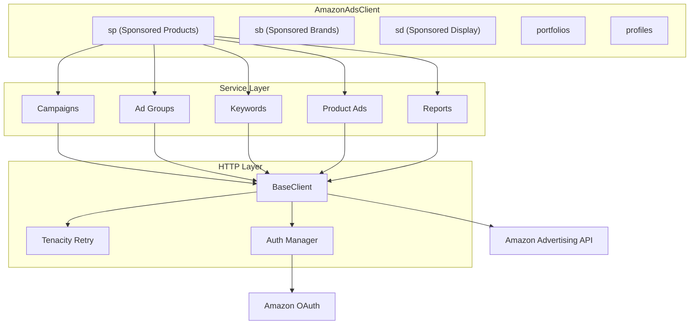
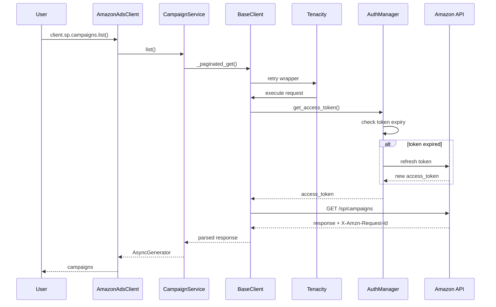
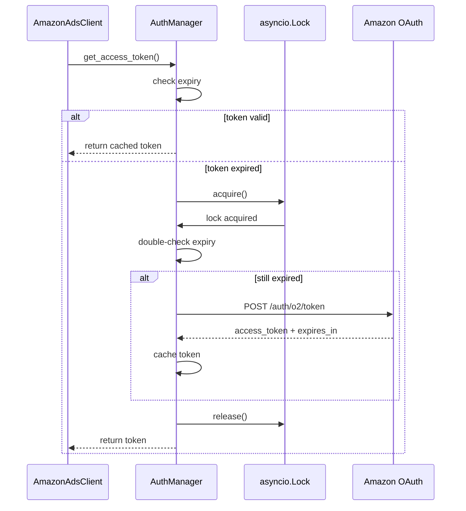
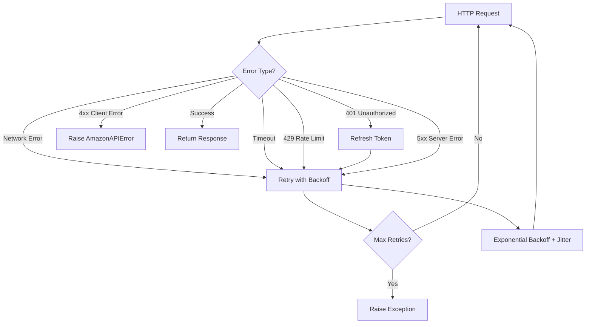
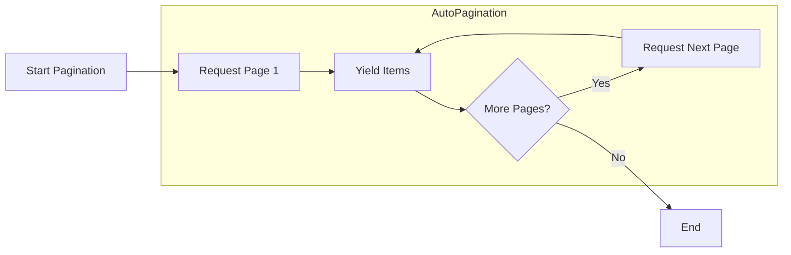
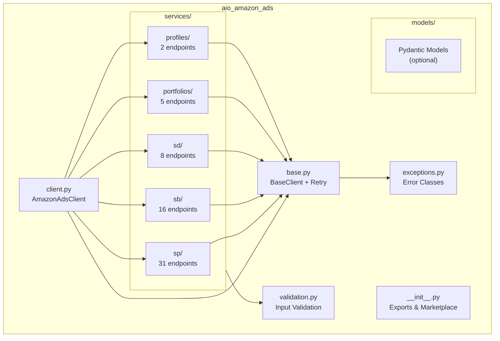
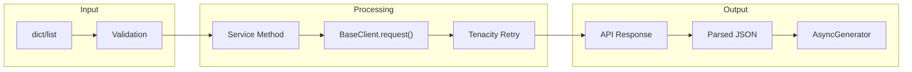
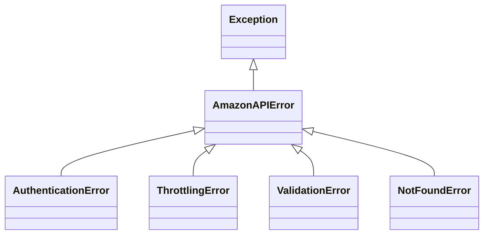

# Architecture

## System Overview



## Request Flow



## Authentication Flow



## Retry Logic



## Pagination Flow



## Package Structure



## Data Flow



## Error Hierarchy



## CI/CD Pipeline

```mermaid
flowchart LR
    subgraph Local
        Code[Code Changes]
        Lint[ruff check/format]
        TypeCheck[mypy]
        Test[pytest]
    end

    subgraph GitHub
        Push[Push to GitHub]
        CI[GitHub Actions CI]
        Test310[Python 3.10]
        Test311[Python 3.11]
        Test312[Python 3.12]
        Test313[Python 3.13]
        Test314[Python 3.14]
        Coverage[Codecov]
    end

    subgraph Release
        Tag[Version Tag]
        Release[Release Workflow]
        PyPI[PyPI Publish]
    end

    Code --> Lint
    Lint --> TypeCheck
    TypeCheck --> Test
    Test --> Push
    Push --> CI
    CI --> Test310
    CI --> Test311
    CI --> Test312
    CI --> Test313
    CI --> Test314
    Test310 --> Coverage
    Test311 --> Coverage
    Test312 --> Coverage
    Test313 --> Coverage
    Test314 --> Coverage

    Test --> Tag
    Tag --> Release
    Release --> PyPI
```

## Key Design Decisions

### 1. Native Async
- Built on `httpx` for true async/await
- No sync wrapper overhead
- Proper connection pooling

### 2. Service Namespacing
```python
client.sp.campaigns.list()      # Sponsored Products
client.sb.campaigns.list()      # Sponsored Brands
client.sd.campaigns.list()      # Sponsored Display
```

### 3. Auto-Pagination
- All `list()` methods return `AsyncGenerator`
- Automatically fetches all pages
- Memory efficient for large datasets

### 4. Tenacity Retry
- Exponential backoff with jitter
- Configurable retry count
- Handles 401, 429, network errors

### 5. Token Management
- Automatic refresh on expiry
- Lock prevents concurrent refresh
- Transparent to user

### 6. Observability
- Structured logging with correlation IDs
- X-Amzn-Request-Id tracking
- Debug logging for all requests
